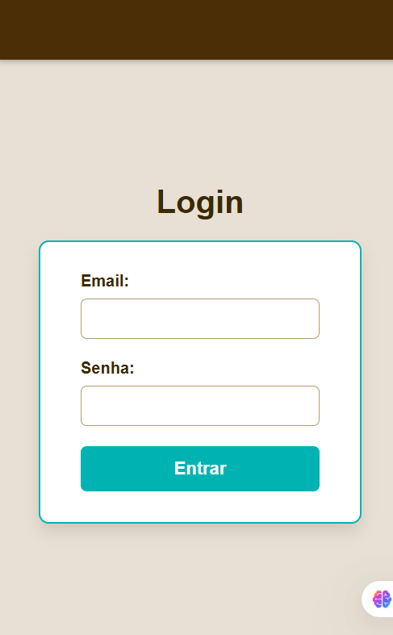
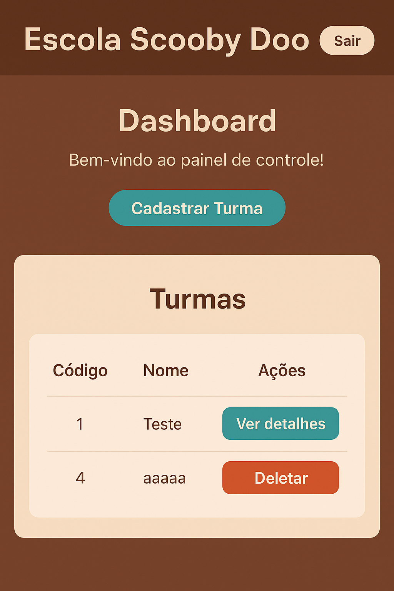

# Avaliação Prática: Sistema de Turmas e Atividades

## Objetivo
Criar um **sistema web full-stack** para controle de turmas e atividades de professores, permitindo registrar, visualizar e excluir turmas e atividades.

## Contextualização
A falta de organização das atividades aplicadas pelos professores prejudica a gestão do conhecimento já trabalhado e avaliado.  
Em muitas escolas de áreas remotas do Brasil, a ausência de um sistema adequado impacta estudantes, professores e o processo educacional.

## Desafio
O sistema deve permitir ao professor:
- Autenticar-se de forma segura;
- Visualizar, registrar e excluir turmas;
- Registrar e gerenciar atividades relacionadas às turmas;
- Encerrar a sessão com segurança.

---

## Requisitos de Infraestrutura

**Banco de Dados:**  
- SGBD: MySQL  
- Versão recomendada: 8.0 ou superior  
- Criar banco exclusivo para o projeto com usuário e senha configurados.

**Servidor / Sistema Operacional:**  
- SO: Windows 10/11  
- Servidor: Node.js (versão 18 ou superior)

**Linguagens e Frameworks:**  
- Back-end: JavaScript (Node.js, Express, Prisma ORM)  
- Front-end: HTML, CSS  
- Banco de Dados: MySQL

---

## Instalação e Execução

1. **Clonar o repositório**
```bash
git clone https://github.com/GuilhermeCanina/escolaavaliacao.git
cd escolaavaliacao


### 1. Clonar o Repositório

```bash
git clone https://github.com/olavomarques/escolaavaliacao.git
cd escolaavaliacao
```

### 2. Instalar Dependências

```bash
npm install
ou
npm i
```

### 3. Configurar Banco de Dados
- Crie um banco de dados MySQL específico para o projeto.  
- Configure usuário e senha no arquivo `.env`:

```env
DATABASE_URL="mysql://root@localhost:3306/nome_do_banco"
```

### 4. Rodar Migrations do Prisma

```bash
npx prisma migrate dev --name init
```

### 5. Iniciar o Servidor

```bash
npm run dev
```

O servidor estará disponível em `http://localhost:3001`.

### 6. Testar o Sistema
- Acesse pelo navegador ou utilize o **Insomnia/Postman** para testar a API.  
- Funcionalidades para testar:
  - Cadastro, listagem, edição e exclusão de turmas;
  - Cadastro, listagem, edição e exclusão de atividades;
  - Login e logout do professor.
## Telas

### Tela de Login


### Tela Dashboard



### Tela Cadastro


### Tela Atividades


